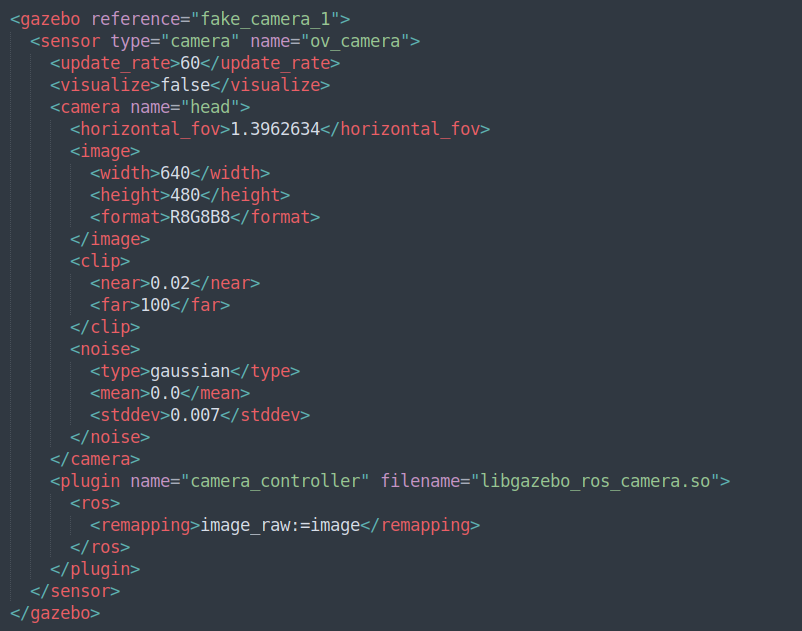
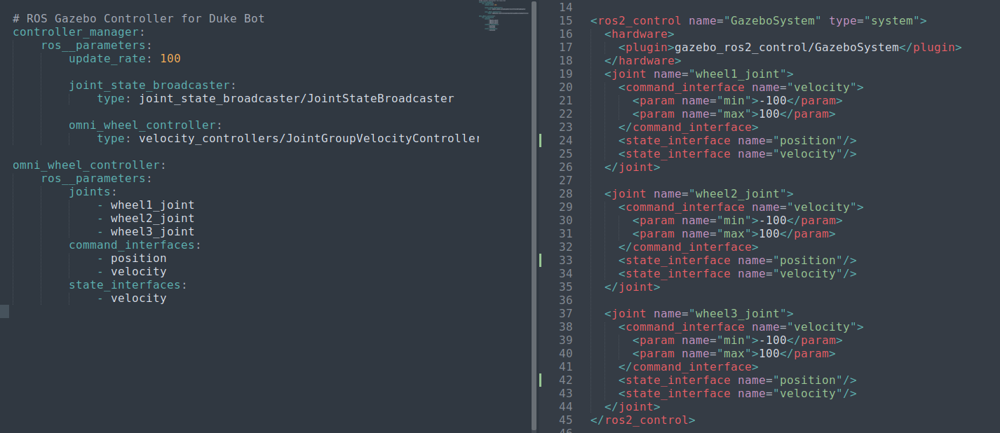

# Duke Bot

The Duke Bot is modeled for navigation tasks from scratch using Fusion360. The CAD Model of our design is shown in the image. 

    

Note: The steps mentioned below are only for users to develop their custom designs and test them on the Gazebo simulator.

After, completing the entire design of the CAD model, the design is converted to the ROS2 package using the [fusion2urdf-ros2](https://github.com/dheena2k2/fusion2urdf-ros2.git) repository. Instructions to install and use this plugin are mentioned on the repository itself.

To export the CAD model to the ROS2 package there are some important rules to follow such as
1. One of the components should have base_link as the component name.
2. Design should not have references to other CAD Models
3. To color individual parts of the model, they should be attached as separate components.
4. Do not move the components after creating joints in the model.

## Adding ROS Gazebo Elements

After exporting the design, there are some steps to add color and gazebo plugins.
Get to know some of the plugins available on ROS Gazebo package using the [link](https://medium.com/@bytesrobotics/a-review-of-the-ros2-urdf-gazebo-sensor-91e947c633d7)
1. Copy-Paste the exported ROS2 package into the ROS2 workspace.
2. Open urdf/duke_bot.gazebo. To add or change color to the component. Edit this file as shown in the image.
    
3. To add gazebo plugins visit this [link](https://github.com/ros-simulation/gazebo_ros_pkgs/wiki). An example to add a camera gazebo plugin is shown in the image.
   
4. Add controller for the wheels to drive it on Gazebo. Refer to the image to add a simple velocity controller.
    

5. Once all the changes are made, build the package and source it.

## Test the Package

Run the command to test the package.

    # Open the design on Rviz
    ros2 launch duke_bot_description display.launch.py
    # Open the design on Gazebo
    ros2 launch duke_bot_description gazebo.launch.py
    # Open the bot with Controllers
    ros2 launch duke_bot_description duke_bot.launch.py

Verify the added plugins.

    # Check whether all plugins are available to use
    ros2 topic list
    # This design has a lidar, camera and differential drive plugin
    # Use this command to echo the messages from appropriate topics
    ros2 topic echo /topic # Make sure that the gazebo is not paused
    # You can also use rqt GUI to test the topics
    rqt

    

